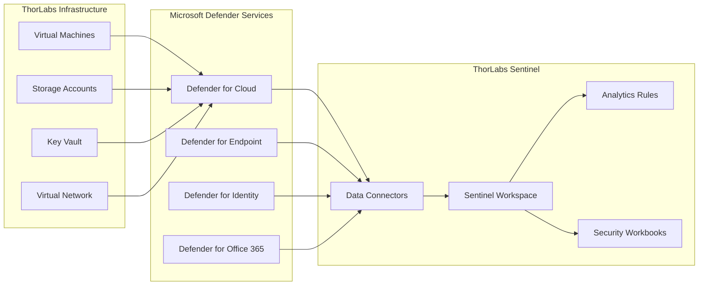

# Microsoft Defender for Cloud Integration with Sentinel

## Programmatic Integration Options

### 1. **Bicep Template Integration** (Recommended)
Add to your Sentinel deployment:

```bicep
// Microsoft Defender for Cloud Data Connector
resource defenderDataConnector 'Microsoft.SecurityInsights/dataConnectors@2023-02-01' = {
  scope: logAnalyticsWorkspace
  name: 'thorlabs-defender-connector'
  kind: 'MicrosoftDefenderAdvancedThreatProtection'
  properties: {
    tenantId: tenant().tenantId
    dataTypes: {
      alerts: {
        state: 'Enabled'
      }
    }
  }
}

// Microsoft Defender for Endpoint Connector
resource defenderEndpointConnector 'Microsoft.SecurityInsights/dataConnectors@2023-02-01' = {
  scope: logAnalyticsWorkspace
  name: 'thorlabs-defender-endpoint-connector'
  kind: 'MicrosoftThreatProtection'
  properties: {
    tenantId: tenant().tenantId
    dataTypes: {
      incidents: {
        state: 'Enabled'
      }
    }
  }
}

// Microsoft Defender for Identity Connector
resource defenderIdentityConnector 'Microsoft.SecurityInsights/dataConnectors@2023-02-01' = {
  scope: logAnalyticsWorkspace
  name: 'thorlabs-defender-identity-connector'
  kind: 'AzureAdvancedThreatProtection'
  properties: {
    tenantId: tenant().tenantId
    dataTypes: {
      alerts: {
        state: 'Enabled'
      }
    }
  }
}

// Microsoft Defender for Office 365 Connector
resource defenderO365Connector 'Microsoft.SecurityInsights/dataConnectors@2023-02-01' = {
  scope: logAnalyticsWorkspace
  name: 'thorlabs-defender-o365-connector'
  kind: 'MicrosoftThreatIntelligence'
  properties: {
    tenantId: tenant().tenantId
    dataTypes: {
      microsoftEmergingThreatFeed: {
        state: 'Enabled'
        lookbackPeriod: 'All'
      }
    }
  }
}
```

### 2. **Azure CLI Automation**
```bash
#!/bin/bash
# ThorLabs Defender Integration Script

RESOURCE_GROUP="thorlabs-rg1-eastus2"
WORKSPACE_NAME="thorlabs-sentinel1-eastus2"
SUBSCRIPTION_ID=$(az account show --query id -o tsv)
TENANT_ID=$(az account show --query tenantId -o tsv)

# Enable Microsoft Defender for Cloud
az security auto-provisioning-setting update \
  --name default \
  --auto-provision on

# Configure Defender for Cloud integration with Sentinel
az sentinel data-connector create \
  --resource-group $RESOURCE_GROUP \
  --workspace-name $WORKSPACE_NAME \
  --name "MicrosoftDefenderAdvancedThreatProtection" \
  --kind "MicrosoftDefenderAdvancedThreatProtection" \
  --data-types '{"alerts":{"state":"Enabled"}}'

# Enable Defender for Servers
az security pricing create \
  --name VirtualMachines \
  --tier Standard \
  --sub-plan P2

# Enable Defender for Storage
az security pricing create \
  --name StorageAccounts \
  --tier Standard

# Enable Defender for Key Vault
az security pricing create \
  --name KeyVaults \
  --tier Standard
```

### 3. **PowerShell Integration**
```powershell
# ThorLabs Defender-Sentinel Integration
# Connect to Azure and Sentinel

Connect-AzAccount
Import-Module Az.SecurityInsights

$ResourceGroupName = "thorlabs-rg1-eastus2"
$WorkspaceName = "thorlabs-sentinel1-eastus2"
$SubscriptionId = (Get-AzContext).Subscription.Id

# Enable Microsoft Defender for Cloud Data Connector
$DataConnectorId = [GUID]::NewGuid().ToString()
New-AzSentinelDataConnector `
  -ResourceGroupName $ResourceGroupName `
  -WorkspaceName $WorkspaceName `
  -Id $DataConnectorId `
  -Kind "MicrosoftDefenderAdvancedThreatProtection" `
  -AlertState "Enabled"

# Create Defender-specific Analytics Rules
$AlertRuleId = [GUID]::NewGuid().ToString()
New-AzSentinelAlertRule `
  -ResourceGroupName $ResourceGroupName `
  -WorkspaceName $WorkspaceName `
  -AlertRuleId $AlertRuleId `
  -Kind "Scheduled" `
  -DisplayName "ThorLabs - High Severity Defender Alerts" `
  -Description "Monitors high-severity alerts from Microsoft Defender" `
  -Severity "High" `
  -Query "SecurityAlert | where ProductName == 'Microsoft Defender for Cloud' | where AlertSeverity == 'High'"
```

### 4. **REST API Integration**
```json
{
  "kind": "MicrosoftDefenderAdvancedThreatProtection",
  "properties": {
    "tenantId": "{tenant-id}",
    "dataTypes": {
      "alerts": {
        "state": "Enabled"
      }
    }
  }
}
```

## Integration Architecture



## Automated Deployment Integration

### Enhanced Security Layer Template
```bicep
// Add to /workspaces/ThorLabs/infra/02-security.bicep

// Microsoft Defender for Cloud Configuration
resource defenderConfiguration 'Microsoft.Security/pricings@2024-01-01' = {
  name: 'VirtualMachines'
  properties: {
    pricingTier: 'Standard'
    subPlan: 'P2'
  }
}

// Defender Data Connectors Array
var defenderConnectors = [
  {
    name: 'thorlabs-defender-cloud'
    kind: 'MicrosoftDefenderAdvancedThreatProtection'
    dataTypes: { alerts: { state: 'Enabled' } }
  }
  {
    name: 'thorlabs-defender-endpoint'
    kind: 'MicrosoftThreatProtection'
    dataTypes: { incidents: { state: 'Enabled' } }
  }
  {
    name: 'thorlabs-defender-identity'
    kind: 'AzureAdvancedThreatProtection'
    dataTypes: { alerts: { state: 'Enabled' } }
  }
]

// Deploy Defender Connectors
resource defenderDataConnectors 'Microsoft.SecurityInsights/dataConnectors@2023-02-01' = [for connector in defenderConnectors: {
  scope: logAnalyticsWorkspace
  name: connector.name
  kind: connector.kind
  properties: {
    tenantId: tenant().tenantId
    dataTypes: connector.dataTypes
  }
}]
```

## Monitoring and Validation

### KQL Queries for Integration Verification
```kusto
// Verify Defender data ingestion
SecurityAlert
| where TimeGenerated > ago(24h)
| where ProductName contains "Defender"
| summarize AlertCount = count() by ProductName, AlertSeverity
| order by AlertCount desc

// Check data connector health
SentinelHealth
| where TimeGenerated > ago(1h)
| where SentinelResourceType == "DataConnector"
| where SentinelResourceName contains "defender"
| project TimeGenerated, SentinelResourceName, Status, Description
```

## Benefits of Integration

1. **Unified Security Operations**: Single pane of glass for all security events
2. **Advanced Analytics**: Correlate Defender alerts with other security data
3. **Automated Response**: SOAR capabilities with Defender intelligence
4. **Compliance**: Enhanced security posture for enterprise requirements
5. **Cost Optimization**: Centralized security data management

## Next Steps for ThorLabs Implementation

1. **Add Defender connectors to security layer Bicep template**
2. **Deploy enhanced security monitoring**
3. **Configure custom analytics rules for ThorLabs environment**
4. **Set up automated incident response workflows**
5. **Create security dashboards and reports**
