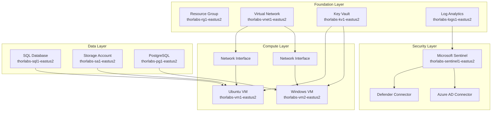

# ThorLabs Environment Visualization Guide

## Quick Visual Access Options

### 1. **Unified Microsoft Defender Portal** (Best Experience) 
🆕 **NEW**: Unified SIEM + XDR in one place
- Go to: [security.microsoft.com](https://security.microsoft.com)
- Click "Connect a workspace" → Select ThorLabs Sentinel workspace
- View unified security topology, incidents, and threat intelligence
- Access Microsoft Copilot for Security (premium feature)

### 2. **Azure Portal Resource Visualizer** (Infrastructure Focus)
Navigate to your resource group in Azure Portal:
- Go to: `portal.azure.com` → Resource Groups → `thorlabs-rg1-eastus2`
- Click "Resource Visualizer" from the left menu
- View interactive topology with dependencies

### 3. **Azure Workbooks Dashboard** (Rich Analytics)
Pre-built in your Sentinel deployment:
- Navigate to Sentinel workspace: [ThorLabs Sentinel Portal](https://portal.azure.com/#@{tenant-id}/blade/Microsoft_Azure_Security_Insights/MainMenuBlade/0)
- Go to "Workbooks" → "ThorLabs Security Overview"  
- View security topology and data flows

### 4. **Azure Network Watcher Topology** (Network Focus)
For detailed network visualization:
```bash
# Enable Network Watcher (if not already enabled)
az network watcher configure --resource-group NetworkWatcherRG --locations eastus2 --enabled

# View network topology  
az network watcher show-topology --resource-group thorlabs-rg1-eastus2
```

### 5. **Bicep Visualizer** (Infrastructure as Code)
For template visualization:
- Install Bicep VS Code extension
- Open any `.bicep` file in `/workspaces/ThorLabs/infra/`
- Click "Visualize" button in VS Code
- See infrastructure dependencies and relationships

## Unified Security Portal Benefits

### **Why Use security.microsoft.com:**
- **🔄 Single Pane of Glass**: All ThorLabs security data unified
- **🤖 AI-Powered Insights**: Microsoft Copilot for Security integration  
- **⚡ Streamlined Workflows**: No context switching between tools
- **📊 Enhanced Correlation**: Cross-platform threat intelligence
- **🎯 Automated Response**: Unified incident management

### **Quick Setup:**
```bash
# Connect ThorLabs to unified portal
./scripts/connect-unified-security.sh
```

## Programmatic Visualization Tools

### **Azure Resource Graph Explorer**
Query and visualize resources programmatically:
```kusto
// Get all ThorLabs resources with relationships
Resources
| where resourceGroup startswith "thorlabs"
| project name, type, location, properties
| join kind=leftouter (
    ResourceContainers
    | where type == "microsoft.resources/resourcegroups"
    | project subscriptionId, resourceGroup = name
) on resourceGroup
```

### **PowerBI Integration** (Advanced)
Connect Sentinel data to PowerBI for custom dashboards:
- Use Log Analytics workspace connection
- Create custom topology visualizations
- Real-time security monitoring dashboards

## Current ThorLabs Architecture Overview



## Interactive Network Topology Commands

```bash
# Get detailed network topology
az network watcher show-topology \
  --resource-group thorlabs-rg1-eastus2 \
  --location eastus2 \
  --output table

# View security group flows
az network watcher show-security-group-view \
  --resource-group thorlabs-rg1-eastus2 \
  --vm thorlabs-vm1-eastus2

# Network connectivity verification
az network watcher test-connectivity \
  --source-resource thorlabs-vm1-eastus2 \
  --dest-address thorlabs-vm2-eastus2 \
  --dest-port 3389
```
