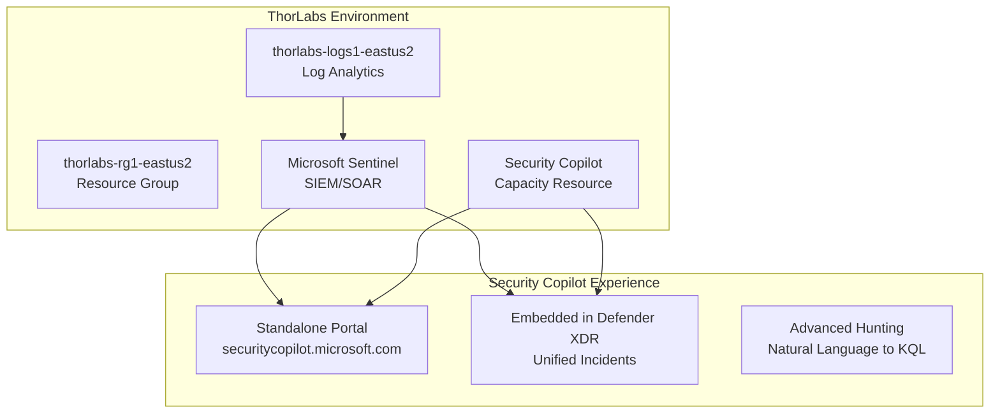

# Microsoft Security Copilot Integration Guide

## Overview
Microsoft Security Copilot is a generative AI-powered security solution that integrates with your existing ThorLabs Microsoft Sentinel workspace (`thorlabs-logs1-eastus2`) to provide AI-powered incident analysis, threat hunting, and security operations.

## Prerequisites ✅

### Existing ThorLabs Infrastructure
- ✅ **Microsoft Sentinel Workspace**: `thorlabs-logs1-eastus2` in `thorlabs-rg1-eastus2`
- ✅ **Log Analytics Workspace**: Already configured and operational
- ✅ **Azure Subscription**: Required for SCU billing
- ✅ **Resource Group**: `thorlabs-rg1-eastus2` available for capacity resource

### Required Roles
- **Azure Owner or Contributor**: For capacity resource provisioning
- **Security Administrator**: For Security Copilot configuration
- **Sentinel Contributor**: For workspace integration

## Security Copilot Architecture



## Setup Process

### Phase 1: Capacity Provisioning (Azure Portal)

**⚠️ Important**: Billing starts immediately upon capacity creation

1. **Access Azure Portal**
   ```bash
   # Open Azure Portal
   open https://portal.azure.com
   ```

2. **Create Security Copilot Capacity**
   - Search for "Security Copilot" in Azure Portal
   - Select **Resource groups** > **thorlabs-rg1-eastus2**
   - Under **Plan**, select **Microsoft Security Copilot** > **Create**

3. **Configuration Settings**
   ```yaml
   Subscription: [Your Azure Subscription]
   Resource Group: thorlabs-rg1-eastus2
   Capacity Name: thorlabs-copilot1-eastus2
   Location: East US 2
   Provisioned SCUs: 3 (recommended for evaluation)
   Overage Units: Unlimited (for usage spikes)
   Data Processing: East US 2 (primary)
   Global Processing: ✅ Enabled (for performance)
   ```

4. **Estimated Monthly Cost**
   - **3 SCUs**: ~$4/hour × 24h × 30 days = ~$2,880/month
   - **Overage**: Pay-per-use for spikes
   - **Optimization**: Monitor usage dashboard and adjust

### Phase 2: Security Copilot Portal Setup

1. **Complete Initial Setup**
   ```bash
   # Navigate to Security Copilot Portal
   open https://securitycopilot.microsoft.com
   ```

2. **Workspace Configuration**
   ```yaml
   Workspace Name: ThorLabs-SecOps
   Default Sentinel Workspace: thorlabs-logs1-eastus2
   Data Sharing: Configure per security policy
   Audit Logging: Enable Microsoft Purview integration
   ```

3. **Role Assignment**
   ```yaml
   Security Copilot Owner: Security team leads
   Security Copilot Contributor: SOC analysts, security engineers
   Access Scope: ThorLabs organization only
   ```

### Phase 3: Sentinel Integration

1. **Configure Default Workspace**
   - Open **Sources** in Security Copilot prompt bar
   - Enable **Microsoft Sentinel (Preview)** plugin
   - Configure default workspace: `thorlabs-logs1-eastus2`

2. **Defender XDR Integration** (Optional but Recommended)
   ```yaml
   Integration Type: Unified Security Operations Platform
   Sentinel Workspace: thorlabs-logs1-eastus2
   Unified Incidents: Enabled
   Advanced Hunting: Cross-platform queries
   ```

3. **Plugin Configuration**
   ```yaml
   Enabled Plugins:
     - Microsoft Sentinel (Preview)
     - Natural language to KQL for Microsoft Sentinel (Preview)
     - Microsoft Defender Threat Intelligence
     - Microsoft Entra ID
   ```

## Key Features & Use Cases

### Incident Response
```
Prompt: "Summarize incident INC-2024-001 from workspace thorlabs-logs1-eastus2"
Result: AI-powered incident analysis with context and recommendations
```

### Threat Hunting
```
Prompt: "Find suspicious login activities in the last 24 hours"
Result: Generated KQL query + executed results + analysis
```

### Security Posture
```
Prompt: "What are the top security risks in my environment?"
Result: Risk assessment based on Sentinel data and threat intelligence
```

## Operational Procedures

### Daily Operations
1. **Monitor Usage Dashboard**
   - Track SCU consumption
   - Identify usage patterns
   - Adjust capacity as needed

2. **Review AI Insights**
   - Check incident summaries
   - Validate hunting queries
   - Document false positives

### Weekly Reviews
1. **Capacity Optimization**
   - Analyze usage reports
   - Right-size SCU allocation
   - Review overage usage

2. **Integration Health**
   - Verify Sentinel connectivity
   - Test plugin functionality
   - Update configurations

## Security & Compliance

### Data Protection
- **Encryption**: Data encrypted in transit and at rest
- **Residency**: Data stored in tenant geography (East US 2)
- **Retention**: Configurable audit logging via Microsoft Purview
- **Access Control**: RBAC integration with Entra ID

### Compliance Certifications
- ISO 27001, 27018, 27017, 27701
- SOC 2 Type II
- HIPAA BAA available
- HiTrust CSF certified

## Cost Management

### Optimization Strategies
1. **Right-size Capacity**
   ```yaml
   Start: 3 SCUs for evaluation
   Production: Scale based on team size and usage
   Peak Hours: Use overage for spikes
   Off-hours: Consider scaling down (advanced)
   ```

2. **Usage Monitoring**
   - Review monthly usage reports
   - Set up billing alerts
   - Track cost per investigation
   - Monitor overage consumption

3. **ROI Metrics**
   - Time saved on incident response
   - Improved threat detection accuracy
   - Reduced investigation time
   - Enhanced analyst efficiency

## Troubleshooting

### Common Issues
1. **Plugin Not Working**
   - Verify workspace permissions
   - Check Sentinel workspace status
   - Confirm plugin is enabled

2. **High SCU Usage**
   - Review query complexity
   - Optimize prompt engineering
   - Consider usage patterns

3. **Integration Problems**
   - Validate network connectivity
   - Check authentication tokens
   - Review audit logs

### Support Resources
- [Security Copilot Documentation](https://learn.microsoft.com/en-us/copilot/security/)
- [Microsoft Security Community](https://techcommunity.microsoft.com/security)
- [Azure Support Portal](https://portal.azure.com/#blade/Microsoft_Azure_Support/HelpAndSupportBlade)

## Next Steps

### Immediate (Week 1)
1. ✅ Provision Security Copilot capacity
2. ✅ Complete portal setup and configuration
3. ✅ Configure Sentinel workspace integration
4. ✅ Assign user roles and permissions

### Short Term (Month 1)
1. 🔄 Train security team on Security Copilot
2. 🔄 Develop standard prompts and playbooks
3. 🔄 Integrate with existing SOC workflows
4. 🔄 Establish usage monitoring procedures

### Long Term (Quarter 1)
1. 📋 Evaluate Defender XDR unified platform
2. 📋 Implement advanced hunting automation
3. 📋 Develop custom plugins if needed
4. 📋 Scale capacity based on usage patterns

---

**Created**: December 2024  
**Owner**: ThorLabs Security Team  
**Review**: Monthly capacity and usage optimization  
**Version**: 1.0
